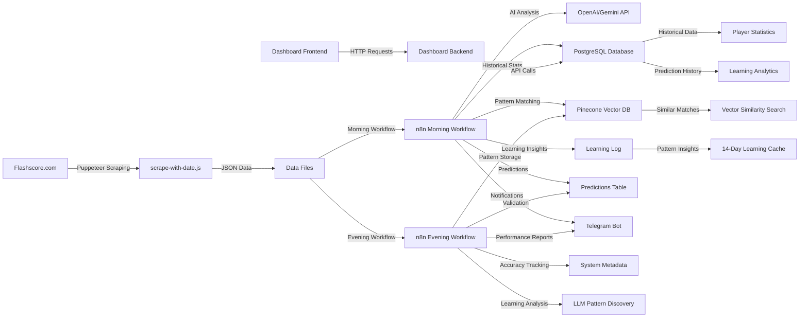

# Tennis Scraper Project Architecture

## Overview

This project is a comprehensive **AI-powered tennis prediction system** that combines web scraping, machine learning, and database analytics to generate intelligent betting predictions. The system operates in two main workflows: **morning predictions** (AI-generated pre-match analysis) and **evening results** (prediction validation and learning).

**Key Innovation**: Unlike simple scrapers, this system uses **n8n workflows** with OpenAI integration to provide sophisticated match analysis, confidence scoring, and continuous learning from prediction accuracy.

## Core Components

### 0. n8n Workflow Engine (Main Processing Logic)
- **Files**: `morning phase v1.9 - optimized.json`, `evening routine v2.2.json`
- **Technology**: n8n workflow automation platform
- **Purpose**: Intelligent match analysis, prediction generation, and learning validation

#### Morning Workflow (AI Prediction Generation)
```json
// Workflow: morning phase v1.9 - optimized
1. Webhook receives scraped matches → 
2. System Health Check (PostgreSQL metadata) → 
3. Loop Over Items (process each match) → 
4. Query Player Stats (PostgreSQL) → 
5. Query Similar Matches (Pinecone vector search) → 
6. Query Learning Insights (PostgreSQL) → 
7. Build Match Context (JavaScript) → 
8. AI Analysis (OpenAI/Gemini) → 
9. Format Predictions (JavaScript) → 
10. Store in Database (PostgreSQL) → 
11. Send Telegram Summary
```

**AI Processing Features:**
- **Dynamic Confidence Scoring**: Based on system learning phase (60% → 75% → 100%)
- **Signal Boosting**: AI-discovered patterns boost player statistics
- **Learning Integration**: Applies discovered patterns from 14-day analysis
- **Vector Similarity**: Uses Pinecone for historical match pattern matching
- **Risk Assessment**: Automated betting recommendation (bet/skip/monitor)

#### Evening Workflow (Prediction Validation & Learning)
```json
// Workflow: evening routine v2.2
1. Webhook receives completed matches → 
2. Extract matches → 
3. Loop Over Items → 
4. Find Matching Predictions (PostgreSQL) → 
5. Update Prediction Accuracy → 
6. Calculate Daily Statistics → 
7. Update System Metadata → 
8. Extract LLM Learning Analysis → 
9. Upload to Pinecone (Vector database) → 
10. Send Telegram Results Report
```

**Learning Features:**
- **Accuracy Tracking**: Real-time prediction vs actual results
- **Confidence Calibration**: Adjusts system confidence based on performance
- **Vector Learning**: Stores successful/failed prediction patterns in Pinecone
- **Pattern Discovery**: AI analyzes successful prediction patterns for future use
- **Phase Progression**: System evolves through learning phases (1→2→3)

### 1. Data Collection Engine
- **File**: `scrape-with-date.js`
- **Technology**: Node.js + Puppeteer
- **Purpose**: Web scraping engine that extracts tennis match data from Flashscore.com

#### Key Features:
- Automated browser interaction to navigate Flashscore
- Date-aware scraping with flexible date parsing
- Multiple data collection modes:
  - `--today`: Current day's matches
  - `--single-day N`: Specific day N days back
  - `--days-back N`: Multiple days range
- Data filtering options:
  - `--all`: All matches
  - `--pending`: Unfinished matches (no scores)
  - `--finished`: Completed matches (with scores)
  - `--strip-scores`: Remove scores for prediction data

### 2. Automated Workflow Scripts

#### Morning Scrape (`run-morning-scrape.sh`)
```bash
# Collects today's matches WITHOUT scores for predictions
node scrape-with-date.js --today --strip-scores
# Outputs: matches-YYYY-MM-DD-strip-scores.json
# Sends to: predictions webhook
```

#### Evening Scrape (`run-evening-scrape.sh`)
```bash
# Collects yesterday's completed matches WITH scores
node scrape-with-date.js --single-day 1 --finished
# Outputs: matches-YYYY-MM-DD-finished.json
# Sends to: results webhook
```

### 3. Data Storage Format

#### Match Data Schema:
```json
{
  "tournament": "Athens (Greece), hard (indoor)",
  "country": "Greece", 
  "surface": "Hard",
  "player1": "Dzumhur D.",
  "nationality1": "Bosnia and Herzegovina",
  "player2": "Fearnley J.",
  "nationality2": "United Kingdom",
  "odds1": "2.80",
  "odds2": "1.42", 
  "score": "7-6 6-7 7-5",
  "winner": "Tabilo A.",
  "homeSetScore": "2",
  "awaySetScore": "1",
  "match_date": "2025-11-02"
}
```

### 4. Dashboard Application

#### Backend (`dashboard/backend/`)
- **Technology**: Go + PostgreSQL
- **File**: `main.go`
- **Compiled Binary**: `tennis-dashboard`
- **Port**: Runs on backend service

**API Structure:**
- RESTful API for match data management
- Database integration with PostgreSQL
- CORS enabled for frontend communication

#### Frontend (`dashboard/frontend/`)
- **Technology**: Vite + React + TypeScript
- **Styling**: Tailwind CSS
- **Build Tool**: Vite
- **Production**: `dist/` folder contains built assets

**Key Components:**
- Match data visualization
- Interactive dashboard interface
- Real-time data updates
- Responsive design for all devices

### 5. Database Schema & AI Integration

#### Core Tables:
- **predictions**: AI-generated predictions with confidence scores
- **players**: Historical player statistics and performance metrics  
- **system_metadata**: Learning phase, accuracy tracking, system health
- **learning_log**: AI-discovered patterns and insights
- **matches**: Raw scraped match data

#### AI Services Integration:
- **OpenAI/Gemini**: Primary prediction engine
- **Pinecone**: Vector similarity search for pattern matching
- **PostgreSQL**: Structured data storage and analytics
- **Telegram Bot**: Real-time notifications and reports

#### Learning System:
- **Phase 1 (Days 0-7)**: Limited confidence (60%), odds-focused
- **Phase 2 (Days 7-21)**: Moderate confidence (75%), pattern emergence  
- **Phase 3 (Days 21+)**: Full confidence (100%), mature system

## Data Flow Architecture



## Operational Workflows

### Workflow A: Morning AI Predictions
1. **Collection**: Scrape today's matches without scores via `scrape-with-date.js`
2. **Distribution**: Send raw data to n8n webhook (`tennis-predictions`)
3. **AI Analysis**: n8n workflow processes each match:
   - Enriches with historical player stats (PostgreSQL)
   - Searches for similar historical matches (Pinecone)
   - Applies discovered learning patterns
   - Generates AI-powered predictions (OpenAI/Gemini)
4. **Output**: `matches-YYYY-MM-DD-strip-scores.json` + database predictions
5. **Notifications**: Telegram summary with top predictions
6. **Use Case**: Real-time betting predictions with confidence scoring

### Workflow B: Evening Results & Learning  
1. **Collection**: Scrape yesterday's completed matches with scores
2. **Distribution**: Send results to n8n webhook (`tennis-results`)
3. **Validation**: n8n workflow matches results against predictions
4. **Learning**: Updates accuracy metrics and discovers new patterns
5. **Vector Storage**: Uploads successful patterns to Pinecone for future matching
6. **Output**: Updated database with accuracy metrics + learning insights
7. **Notifications**: Performance report with accuracy breakdown
8. **Use Case**: Continuous improvement and confidence calibration

## Configuration Management

### Environment Setup
- **Root Directory**: `/opt/tennis-scraper`
- **Node.js Dependencies**: Puppeteer for web automation
- **Go Dependencies**: Database drivers, web framework
- **Frontend Dependencies**: React ecosystem, build tools

### Webhook Configuration
```bash
# Morning predictions webhook
WEBHOOK_URL="http://193.24.209.9:5678/webhook/tennis-predictions"

# Evening results webhook  
WEBHOOK_URL="http://193.24.209.9:5678/webhook/tennis-results"
```

## Key Technical Features

### Advanced AI Integration
- **OpenAI/Gemini LLM**: Sophisticated match analysis with reasoning
- **Dynamic Confidence Scoring**: AI-calibrated based on learning phase
- **Pattern Discovery**: Automatic identification of successful prediction patterns
- **Vector Similarity**: Pinecone-powered historical match analysis
- **Learning Signal Boosting**: AI-discovered patterns enhance player statistics

### Robust Date Handling
- Multiple date format parsing (Flashscore's DD/MM format)
- Automatic date extraction from webpage
- Fallback mechanisms for date parsing failures
- Support for historical data collection

### Data Quality Assurance
- Validation of essential fields (tournament, country, odds, etc.)
- Player nationality and flag extraction
- Surface type detection (Hard, Clay, Grass, Carpet)
- Score formatting and winner determination

### Error Handling & Reliability
- Graceful handling of network timeouts
- Cookie banner dismissal
- Element waiting strategies
- Comprehensive logging for debugging

### Continuous Learning System
- **Real-time Accuracy Tracking**: Predictions vs actual results
- **Phase-based Progression**: System evolves through learning stages
- **Pattern Storage**: Successful patterns stored in vector database
- **Signal Calibration**: AI adjusts confidence based on performance
- **Historical Analysis**: 14-day learning insights integration

## Data Processing Pipeline

### 1. Web Scraping
- Navigate Flashscore.com tennis section
- Click ODDS tab for betting data
- Extract tournament metadata (country, surface)
- Parse match information (players, odds, scores)

### 2. AI-Powered Analysis (n8n Workflows)
- **Morning Workflow**: Generate predictions using AI analysis
- **Evening Workflow**: Validate predictions and extract learning insights
- Apply discovered patterns from historical data
- Generate confidence scores based on learning phase
- Store vector embeddings in Pinecone for similarity matching

### 3. Database Integration
- Store predictions with metadata in PostgreSQL
- Update player statistics based on results
- Track system accuracy and learning progression
- Log learning patterns for future application

### 4. Learning & Improvement
- Analyze prediction accuracy in real-time
- Discover new patterns through AI analysis
- Calibrate confidence scoring based on performance
- Progress through learning phases (60% → 75% → 100%)
- Upload successful patterns to vector database

### 5. Notification & Reporting
- Telegram bot for real-time updates
- Daily accuracy reports with confidence breakdown
- Top prediction alerts for high-confidence matches
- Learning insights summary for system improvement

## Monitoring & Logging

### System Monitoring
- Timestamp logging in scripts
- File existence validation
- Webhook response monitoring
- Error tracking and reporting

### Data Validation
- Match count verification
- Date range validation
- Data completeness checks
- Sample data inspection

## Scalability Considerations

### Performance Optimization
- Puppeteer browser automation
- Efficient DOM querying
- Minimal memory footprint
- Fast data processing

### Future Enhancements
- Multiple data source integration
- Real-time data streaming
- Advanced analytics dashboard
- Machine learning model integration

## Security Notes

### Web Scraping Ethics
- Respectful rate limiting
- No modification of target website
- Compliance with robots.txt
- Minimal resource usage

### Data Security
- Local data file encryption option
- Secure webhook communication
- Database connection security
- Input validation on all endpoints

---

**Last Updated**: 2025-11-03
**Version**: 1.0.0
**System Type**: AI-Powered Tennis Prediction Platform
**Key Innovation**: n8n Workflow Integration with OpenAI/Gemini for Intelligent Match Analysis
**Learning Capability**: Continuous improvement through accuracy tracking and pattern discovery
**Architecture Pattern**: Microservices with AI orchestration via workflow automation
